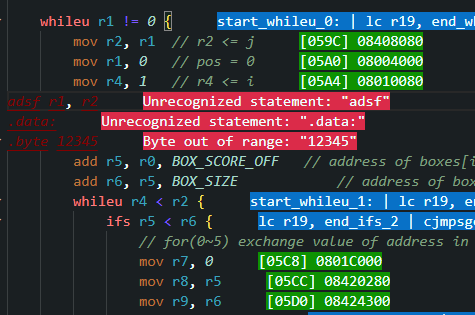
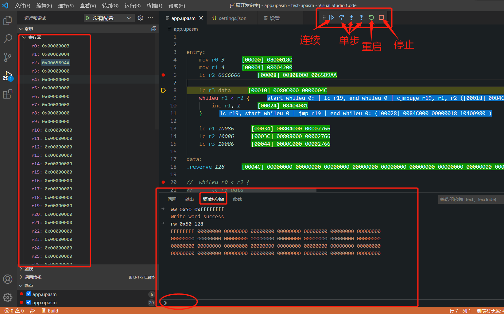

# UPASM插件说明
## 驱动
使用前请确保驱动正确安装.  
[验证过的驱动](ch341驱动/CH341PAR-2022-06-20.EXE)  
官网下载地址: https://www.wch.cn/downloads/CH341PAR_EXE.html

## 安装插件
**注意: 由于插件加载dll的方式, 目前插件能够支持的vscode最高版本号为1.77!!**  
打开visual studio code, 点击左边的扩展按钮, 右上角的[...], 从VSIX安装, 选择upasm-0.10.2.vsix, 开始安装.


## 使用
### 激活
当vscode工作目录下包含\*.upinc, \*.upasm文件时, 插件被自动激活. 为区分一般的汇编代码, 推荐将头文件, 源文件命名为 \*.upinc, \*.upasm. 对于H01工程中的.fct文件, 也需要改为.upasm后缀.

此时, 对于工作区内的代码文件(\*.upinc, \*.upasm, \*.upconf)每一行后会有相应的实际地址和编译结果(绿底字体), 如果有错误则显示错误(红底字体). 当指令中包含变量时, 编辑时不能实时显示变量的实际地址, 按ctrl + s保存可以触发(或者点击Build按钮)链接, 从而让让变量地址显示正确.



### 字体颜色
代码字体的颜色默认跟随vscode, 如果需要达到上图中的效果, 可以在settings.json中添加下面的代码. 这些配置建议加到用户区的settings.json(`C:\Users\用户名\AppData\Roaming\Code\User\settings.json`), 就不用每个工程都配一遍了:

```json
"editor.semanticTokenColorCustomizations": {
	"rules": {
		"comment:upasm": { "foreground": "#80A080", "italic": true },
		"directive:upasm": { "foreground": "#C53EE0", "italic": false },
		"type:upasm": { "foreground": "#33BFE2", "italic": false },
		"string:upasm": { "foreground": "#E29C33", "italic": true },
		"number:upasm": { "foreground": "#A8D8CA", "italic": true },
		"macro:upasm": { "foreground": "#A286BB", "italic": false },
		"label:upasm": { "foreground": "#B99D69", "italic": false },
		"variable:upasm": { "foreground": "#B9A069", "italic": false },
		"instruction:upasm": { "foreground": "#BD753B", "italic": false },
		"register:upasm": { "foreground": "#3BA3BD", "italic": false },
		"keyword:upasm": { "foreground": "#FC7D7D", "italic": false },
		"cmp_operator:upasm": { "foreground": "#7C58FF", "italic": false },
		"bracket:upasm": { "foreground": "#FFE65B", "italic": false },
		"invalid:upasm": { "foreground": "#810000", "italic": true, "underline": true }
	}
},
```

### 工程文件
从v0.10.0版本开始, 所有的可配置项都移入工程文件, vscode的插件设置只保留了一项: **工程文件**.   
如果工程文件的配置项为空字, 则使用在插件安装目录的`congfig`文件夹下的`default.upproj`, 该文件内容如下:
```ini
#BUILD-INFO
TYPE=APP
NAME=app
CFG=u31
STACK_SIZE=0
STACK_OVERFLOW_ADDR=
ENTRY_NAME=entry

#DEBUG-INFO
DEBUG_TYPE=IIC
SIMULATE_DATA=simdata

#OUTPUT-INFO
PATH=out
BIN=true
HEX=true
MAP=true
OBJS=false

#FILES
[ext]upinc
[ext]upasm

#EXCLUDE
[dir]test
[dir]out

#MACROS

#GENERATION
PREFIX=u31_sys
FPU=fpu.upconf
```

工程文件中的内容:  
- #BUILD-INFO: 编译相关的参数
  - TYPE: 编译类型, 支持**APP**和**LIB**两种类型. 如果为空(工程文件中没有这一项), 默认为**APP**
  - NAME: 编译结果名称. 最终生成的bin/hex/map文件名. 可以为任意字符, 默认为**app**
  - CFG: 汇编语法配置, 目前支持3种: **u31**,**h01**,**u100**, 默认为**u31**. 这几种语法都对应插件安装目录下`config`文件夹下对应的csv文件.
  - STACK_SIZE: 用于`#push-regs`和`#pop-regs`的栈的大小, 单位为字节. 默认为0时不可使用`#push-regs`和`#pop-regs`语法.
  - STACK_OVERFLOW_ADDR: 用于`#push-regs`和`#pop-regs`的栈溢出跳转地址, 默认为空时不检查栈溢出.
  - ENTRY_NAME: 程序入口名称, 可设置任意字符, 默认为`entry`.
- #DEBUG-INFO: 调试相关参数
  - DEBUG_TYPE: 调试类型, 支持 **IIC**(IIC调试) 和 **SIM**(模拟器调试) 两种类型, 默认为 **IIC**. 
  - SIMULATE_DATA: 调试类型为**SIM**时, 模拟器数据来源路径.
- #OUTPUT-INFO: 输出相关参数
  - PATH: 输出路径. 默认为`out`.
  - BIN: 可填`true`或`false`是否生成`bin`文件. 默认为`true`.
  - HEX: 可填`true`或`false`是否生成`hex`文件. 默认为`true`.
  - MAP: 可填`true`或`false`是否生成`map`文件. 默认为`false`.
  - OBJS: 可填`true`或`false`是否生成`upasmobj`文件. 默认为`false`.
- #FILES: 参与编译的文件. 每一行为一项. 支持3种格式:
  - 前缀为`[ext]`: 工作目录下所有扩展名匹配的文件.
  - 无任何前缀: 单独的文件名, 无需包含路径.
- #EXCLUDE: 不参与编译的文件.
  - 前缀为`[dir]`: 工作目录下文件夹名字匹配的文件.
  - 无任何前缀: 单独的文件名, 无需包含路径.
- #MACROS: 宏定义. **注意**: 这里的宏定义的值只允许是数字!!
- #GENERATION: 代码生成相关参数.在v0.10.0之前的版本, 这是2个配置项(wola/u31). 这里把2项合并了. 当CFG配置为u31时, 使用u31的代码生成; 当CFG配置为h01时, 使用wola的代码生成.
  - PREFIX: 生成代码文件的前缀.
  - FPU: fpu配置文件, 默认为空. 不为空时, 当切换工程文件时, 会自动用这个配置文件生成代码.

### 插件设置
在vscode界面中按`Ctrl+Shift+P`, 输入`settings`, 选择`首选项:打开设置(ui)`


搜索框中输入`UPASM`, 注意选择`工作区`而不是`用户`!!


这里有1个可配置项目:`upasm.project.filename`

#### `Upasm>Project:filename`
默认为空, 可以指定工作路径下的任意文件名(**相对路径**)作为工程文件.

#### Settings.json
第一次设置完成后, 在工作区下的.vscode目录下会生成一个settings.json文件, 记录上述选项, 后续修改这些选项时可以直接改settings.json文件, 删除这一行(或者整个settings.json文件)表示使用默认工程文件:


### 新建工程文件
在vscode左侧的文件浏览位置按下右键, 菜单中有一项:`Create new.upproj`. 按下时会在选择的路径下新建一个`new.upproj`文件, 并将内容填充为默认设置.  
如果选择的路径下已经存在`new.upproj`文件, 则会将其内容覆盖为默认设置.


### 选择工程文件
对扩展名为`.upproj`的文件点击右键, 菜单中有一项:`Set Current Project File`, 按下时可以将选中的文件设为当前工程文件.(与修改`Settings.json`效果一致)


### 功能按键
插件提供了1个功能按键:


该按键的"Build"后面, 是当前使用的工程文件名.  
按下Build 按钮会保存所有文件, 并生成编译结果文件(.bin/.hex/.map), 其中.bin文件为可执行程序.

### 对汇编的修改

UPASM语法继承自LXP32(https://lxp32.github.io/), 但对其语法做了以下修改:

#### 头文件(.upinc)的限定
头文件中仅允许使用以下语句:  
 `#define` `#include` `#import` `#export` `#if` `#else` `#endif` `#elif` `#instruction-alias` 

#### 逗号`,`和空格` `
逗号是当作空格来处理的, 在分隔的字符串之间任意加入逗号和空格都是合法的.

#### 四字节对齐
每一行代码的长度都必须是4字节对齐.
```
// 以下为错误用法
.byte 0x00		// 长度为1字节, 非法
.short 0x0000	// 长度为2字节, 非法
.byte 0x00 0x00 0x00 // 长度为3字节, 非法
.byte 0x00 0x00 0x00 0x00 0x00 // 长度为5字节, 非法
.short 0x0000 0x0000 0x0000 // 长度为6字节, 非法

// 以下为正确用法
.short 0x0000 0x0000 // 长度为4字节, 合法
.byte 0x00 0x00 0x00 0x00 // 长度为4字节, 合法
.short 0x0000 0x0000 0x0000 0x0000 // 长度为8字节, 合法
```

#### `.align`
LXP32中, .align为编译期对齐, UPASM中改为链接期对齐.

#### `ifs`/`ifu`/`else`条件判断
后缀u/s对应`cjmpu`/`cjmps`指令, 即无符号数/有符号数比较.  
支持 `==` `!=` `<` `>` `<=` `>=` `eb` `neb`	8种比较符, 语法为:  
```
// 不使用else
[ifs/ifu] [操作数1] [比较符] [操作数2] [{]
... // 其他指令
[}] // 必须独占一行

// 使用else
[ifs/ifu] [操作数1] [比较符] [操作数2] [{]
... // 其他指令
[}] [else] [{] //必须独占一行
... // 其他指令
[}] // 必须独占一行
```

其中`eb`,`neb`需要指令`cjmpeb`, `cjmpneb`支持.

#### `whiles`/`whileu`循环语句, `break`/`continue`跳出循环
后缀u/s对应`cjmpu`/`cjmps`指令, 即无符号数/有符号数比较.  
支持 `==` `!=` `<` `>` `<=` `>=` 	6种比较符, 语法为:  
```
[whiles/whileu] [操作数1] [比较符] [操作数2]  [{]
// 其他指令
[}] // } 必须独占一行
```
循环中可用`continue`跳转到循环头部, `break`跳到循环结束处.  
`continue` `break` 后可以接一个数字表示跳出第几层循环.

#### 新增`#section`用于自定义链接地址

- `#section-start`与`#section-end`必须一一配对, 不可嵌套, 不可出现在头文件.
- `#section-start`有2个可选参数:[地址][下载标志].  
	- [地址]必须为非负整数(十进制/十六进制), 省略时, 默认为添加到程序末尾;  
	- [下载标志]为字符串 `download` 或者 `no-download`, 省略时, 默认为`no-download`.  
	- 当2个参数都不省略时, [地址]在前.  
	- `#section-start attach`: `attach`只能单独出现, 表示链接到程序末尾, 且与程序合并为一体.  
- `#section-end`不可接参数.  

注意:  
**目前#section包围的部分(非attach)在Build时不会输出到编译结果文件!!**  
**调试时,`download`标识的部分会下载到板子, 而`no-download`标识的部分不会**

#### 新增`#link-index`用于定义连接顺序.(*该功能为过渡性功能, 将会被弃用.*)
- `#link-index`后接1个数字(0~65534)
- `#link-index`不可出现在头文件.
- `#link-index`只能出现在文件第一行.
- 对于Build APP, entry文件的`#link-index`只能设置为0, 非entry文件`#link-index`不能设置为0.
- 如不设置`#link-index`,普通文件的link-index默认为65535, entry的link-index为0.
- 链接时会按照link-index从小到大排序, link-index相同时, 按照文件名(完整路径)字母排序.

#### 新增`#jump-regs`用于定义跳转寄存器
- `#jump-regs`不可用于头文件
- `#jump-regs`后接多个32位寄存器(可用别名).
- `#jump-regs`后接至少一个寄存器后, 可以用”...”作为结尾. 当”...”结尾时, 用作跳转的寄存器个数会根据后面的需要**在最后一个明确定义的跳转寄存器的基础上**自行增加.
- `#jump-regs`下面的代码中, `whiles`/`whileu`/`ifs`/`ifu`/`continue`/`break`语句中的跳转指令会优先使用`#jump-regs`定义的寄存器, 寄存器不足时, 仍用`rj`作为跳转寄存器.  
Tips:  
	-  `whiles`/`whileu`需要2个跳转寄存器; U31最新指令, jmp/call可以支持最大21bit的立即数和变量, 因此`whiles`/`whileu`只需要1个跳转寄存器了.  
	-  `ifs`/`ifu`需要1个跳转寄存器   
	-  `else`需要1个跳转寄存器   
	-  `continue`/`break`的跳转寄存器跟随`whiles`/`whileu`.
- `#jump-regs`的作用域为当前行到`#jump-regs end`, 或者下一个`#jump-regs`的开始位置, 或者文件结束.
- `#jump-regs`最终会生成为一系列的`lcs`指令.

#### 新增语法: `#instruction-alias`用于自定义指令别名:
```
#instruction-alias (新指令) => (指令1) (指令2) ... (指令n)  
```
- `#instruction-alias`可以出现在头文件中.
- `#instruction-alias`后接至少2个()包围的内容
- 第一个`()`后必须接一个 `=>`
- 括号内的所有token, 如果不是数字, 不可以数字开头.
- `=>`后面的指令必须为原生指令(有特定的opcode), 不可为指令别名.
- 用`#instruction-alias`定义的指令别名如果和csv文件中定义的指令别名冲突, 优先使用csv中定义的指令别名.
- 定义新指令的参数不能是数字, 但可指定替换指令的参数为数字.
```
// 定义自减指令dec
#instruction-alias (dec reg n) => (sub reg reg n)
dec r0 2	// 相当于sub r0 r0 2

// 定义归零指令
#instruction-alias (zero reg) => (lcs reg 0)
zero r0		// 相当于lcs r0 0

// 定义跳转到地址
#instruction-alias (call_addr addr) => (lcs rj addr) (call rj)
call_addr 0x1234	// 相当于2条指令: 
					// lcs rj 0x1234 
					// call rj
```

#### 小括号`()`的用法
为了兼容H01的特殊指令代码, 编译器添加了对小括号的支持. 可以将指令(包含普通指令/特殊指令/模拟器指令)的所有**参数**放在`()`中. 使用小括号时, 小括号内可以任意换行/添加空行. 但必须满足:
- 括号”(“必须和指令同在一行.
- 所有的指令参数必须在括号内.  
```
// 以下写法均为合法
add (r0,r1,r2)

add (r0
r1
r2)

add (
	r0, r1, r2
)

add (r0

r1, r2)
```

#### 新增语法: `#var-u32`用于宏变量定义, `#set-bianry`用于修改变量的某些bit:
```
#var-u32 BINARY_VAL 0xff00ff00 // 定义BINARY_VAL, 设置初始值
#set-binary(BINARY_VAL, 23,  16, 0x22  ) // [23:16]写入0x22, 此时BINARY_VAL的值为0xff22ff00
	lc r0 BINARY_VAL
#set-binary ( BINARY_VAL, 23,  16, 0x33  ) // [23:16]写入0x33, 此时BINARY_VAL的值为0xff33ff00
	lc r0 BINARY_VAL
#set-binary ( BINARY_VAL, 23,  16, 0x44  ) // [23:16]写入0x44, 此时BINARY_VAL的值为0xff44ff00
	lc r0 BINARY_VAL
#set-binary ( BINARY_VAL, 23,  16, 0x55  ) // [23:16]写入0x55, 此时BINARY_VAL的值为0xff55ff00
	lc r0 BINARY_VAL
```
#### 新增语法: `#auto-export-start`, `#auto-export-end`
```
#auto-export-start
A:
B:
C:
...
#auto-export-end
```
在`#auto-export-start`和`#auto-export-end`之间的所有标签, 都会被自动导出为全局变量. 上述代码相当于
```
#export A
A:

#export B
B:

#export C
C:
```

#### 模拟器指令`$load-file`
```
$load-file ["文件名"] [符号名] [长度]
```
其中, 文件名必须用引号包围, 文件目录默认为工作目录下的simdata文件夹. 可通过配置修改;  
符号名为代码中定义的符号名; `$load-file`首次执时行会将整个文件的内容读取到内存, 所以需要避免加载太大的文件,每次执行完后会将下次读取的起始位置指向当前读取的结束位置.  
该指令编译时不会生成指令码, 仅在使用模拟器调试的时候被解析.

#### 模拟器指令`$memcmp`
```
$memcmp [符号1] [符号2] [长度]
```
比较2段数据是否完全一致, 将比较结果通过调试控制台打印出来.  
该指令编译时不会生成指令码, 仅在使用模拟器调试的时候被解析.

#### 条件编译`#if` `#else` `#endif` `#elif`
- 支持`#if` `#else` `#endif` `#elif`用于指定编译内容.
- `#if`/`#elif`后接1个token时, 这个token可以是: `true`/`false`/数字/宏定义的数字. token为数字时, 大于0的值表示`true`, 小于等于0的表示`false`.
- `#if`/`#elif`后接3个token时, 这3个token必须组成表达式, 其中  
	- token[0]/token[2]必须为数字/宏定义的数字  
	- token[1]必须为比较符(`==`, `!=`, `>=`, `<=`, `>`, `<`)中的一种

#### #push-regs和#pop-regs
将32bit寄存器压栈/出栈
- 插件设置(settings.json)中, 需要定义2个参数(默认为空)
   ```
   "upasm.build.stack.length" : 1024,
   "upasm.build.stack.overflow.addr" : "",
   ```
   其中`upasm.build.stack.length`为栈的长度, 必须为4的倍数, 默认为0时`#push-regs`和`#pop-regs`功能不启用;  
   `upasm.build.stack.overflow.addr`为栈溢出时的跳转地址. 默认为空时, 编译器不对栈溢出作检测.

- 当设置好`upasm.build.stack.length`参数时, 编译器会自动生成一个隐藏式文件`REGISTER_STACK_CONTENT.upasm`, 并将它的链接顺序放在最后:
   ```
	#export REGISTER_STACK_ADDR
	REGISTER_STACK_ADDR:	// 栈顶指针
	.word REGISTER_STACK_ADDR_VALUES

	#section-start no-download // 这里使用section, 避免无意义的数据占据生成文件的空间
	REGISTER_STACK_ADDR_VALUES:	// 栈空间
	.reserve 1020 // 这里是settings.json中设定的长度-4
	#section-end
   ```
   
- 调用规则:  
   - #push-regs后面跟2个数字, 分别为要压入栈的寄存器的起始编号和终止编号. 如:
   ```
   #push-regs 10 20 // 将r10, r11...r20压入栈
   ```
	**注意:这些寄存器无法压栈!!!!!**  
	**未开启栈溢出检测时, 编译器需要2个寄存器进行压栈/出栈的操作.开启栈溢出检测时, 需要3个.**  
	**如果csv文件中定义了'rj', 则这些寄存器是'rj'往前的2~3个(包含rj), 否则, 为32bit寄存器的最后2~3个.**

   - #pop-regs不跟任何参数.
   - #push-regs和#pop-regs必须成对使用, 不能嵌套.

### IIC调试器
要运行IIC调试器需要的软/硬件环境:
- CH341USB连接开发板, 开发板供电.
- 代码没有编译错误
- 调试器地址配置正确且完整(成功安装插件后默认是配好的)
- 配置项`Upasm › Debuger: Use_simulator`为false, 否则将进入模拟器调试.(默认为true)

在任意代码界面按下F5进入调试, 编译器会保存所有文件并重新编译(Build APP), 编译成功后调试器会向开发板下载程序, 并停在`0x00000000`地址.  
在调试状态下编辑代码将会弹出警告.



#### 快捷键
- F5: 开始调试/连续运行
- Shift+F5: 停止调试
- F9: 在光标所在行插入断点(或者鼠标点击行首)
- F10/F11/Shift+F11: 单步前进

#### 变量
左侧`调试`面板, 上方的`变量`点开后有`寄存器`,可以实时看到所有寄存器的值.

#### 调试控制台
- 黄色字体会输出调试过程中的错误(主要是iic连接/读写错误)
- 读任意位置的内存命令
```
[rw|rs|rb|rwd|rsd|rbd] [地址] [长度]
rw [地址] [长度] // 读取的值按32bit分割显示
rs [地址] [长度] // 读取的值按16bit分割显示
rb [地址] [长度] // 读取的值按8bit分割显示
rwd [地址] [长度] // 读取的值按32bit分割, 有符号十进制显示
rsd [地址] [长度] // 读取的值按16bit分割, 有符号十进制显示
rbd [地址] [长度] // 读取的值按8bit分割, 有符号十进制显示
```   
- 写任意位置的内存命令
```
[ww|ws|wb] [地址] [值]
ww [地址] [值] // 向指定地址写入32bit
ws [地址] [值] // 向指定地址写入16bit
wb [地址] [值] // 向指定地址写入8bit
```
**注意: 读写的[地址]需要是4的倍数**  
[地址]可以是数字, 也可以是代码中的`全局变量`(即#export的变量)

#### 监视
左侧`调试`面板, 中间的`监视`点开后可以在此处添加寄存器或者内存地址, 方便实时查看.  
监视语法:
```
[地址] [长度] [格式(可选)]
```
其中  
[地址]可以是数字形式(10进制/16进制, 必须是4的倍数), 也可以是代码中的Label, 或者[Label+偏移量]的形式.  
[长度]为数字形式(10进制/16进制, 必须是4的倍数)  
[格式]由3个字母组成, 默认为`whu`
- 第一个字母`w`|`s`|`b`表示分割长度
- 第二个字母`h`|`d`表示16进制/10进制显示
- 第三个字母`u`|`s`表示无符号/有符号

或者
```
[寄存器][格式(可选)]
```  
其中, [寄存器]可以是[r+数字]形式, 也可以是别名/宏定义  


### 模拟调试器


模拟调试器与IIC调试器大体上是一致的, 以下是不同点:
- 当配置项`Upasm › Debuger: Use_simulator`为true时, F5启动调试会进入模拟调试器.
- 当代码中有`SimEntry:`标签时, 程序会从`SimEntry:`进入而不是`0x00000000`地址.
- 模拟调试器有其专有指令`$loadfile`和`$memcmp`
- 不支持特殊指令
- 单步回退功能. 没有快捷键, 仅能使用鼠标点击操作  
   
- 不支持设置程序内存以外的内存地址, 下面代码会使调试报错:  
   
- 模拟调试器在调试结束时会将调试过程中执行过的指令进行统计, 打印到输出:


### 右键菜单功能
#### 批量更新寄存器`Update Registers`
写汇编代码比较麻烦的一点是分配寄存器, 特别是2段代码需要合并的时候, 往往会发现这2段代码使用的寄存器冲突了. 这个功能可以批量替换代码中形如[r数字]格式的寄存器, 使用方法是选中部分代码, 右键, Update Registers, 输入一个新寄存器, Enter.

如下代码, 选中后, 右键, Update Registers, 输入`r10`, 由于选中代码中最小的寄存器是`r0`, 会将`r0`替换为`r10`, `r1`替换为`r11`......  
```
	lcs r0 data1
	lcs r1 data2
	lcs r2 data3
```
更新后的代码:
```
	lcs r10 data1
	lcs r11 data2
	lcs r12 data3
```
该操作可以通过`Ctrl+Z`撤销

#### 配置代码生成
当前文件扩展名为.upconf结尾时, 在文件任意位置点击右键会出现  
`Generate Source from upconf`
生成结果为一个头文件(前缀_macros.upinc)和一个源文件(前缀_macros.upasm).
生成的规则(wola/u31)和前缀内容根据工程文件中的配置项确定.

### 单元测试
当一个工程代码量大的时候, 单元测试就非常重要, 我们往往需要针对某一两个源代码文件重新组织测试数据和调用逻辑来验证功能是否能够正确执行. 此时, 我们是不希望修改现有的整体逻辑, 但又想要能够调试项目的一部分, 就可以使用`单元测试`的功能:

- 在根目录下新建一个文件夹作为单元测试的专用目录, 例如`test`.
- 将`test`加入到工程文件中的排除项, 编译整体工程时, 会将这个目录下的所有文件排除.
- 在`test`目录下新建包含`entry:`的测试代码.
- 在`test`目录下新建一个工程文件.
- 新建工程文件中加入编译测试工程必须的文件, 每行一个文件名, 不用包含路径.
- 将新建工程设为当前工程.
- 如果编译没有错误, 按F5就可以直接调试测试工程了.
- 如果需要将单元测试切换回整体的工程, 可以将原工程设为当前工程.

### 其他功能
#### 悬停显示
**编辑状态**下, 鼠标悬停在代码中的变量/宏定义上时会显示对应的地址/原定义和位置, 按下Ctrl会出现对应位置的代码, 此时再单击鼠标左键会跳转到该位置. 

**调试状态**下鼠标悬停在寄存器上则会显示寄存器的值, 此时按下Alt显示内容会切换为编辑状态下的内容.
