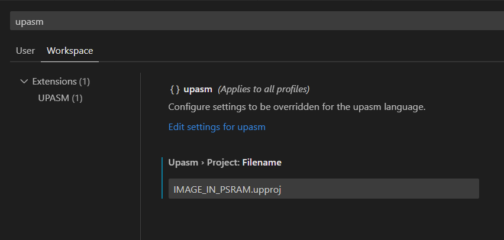

# UPASM插件说明
## 驱动
使用前请确保驱动正确安装.  
[验证过的驱动](ch341驱动/CH341PAR-2022-06-20.EXE)  
官网下载地址: https://www.wch.cn/downloads/CH341PAR_EXE.html

## 安装插件

插件需要的vcruntime:
https://learn.microsoft.com/en-us/cpp/windows/latest-supported-vc-redist?view=msvc-170

**注意: 由于插件加载dll的方式, 目前插件能够支持的vscode最高版本号为1.77!!**  
打开visual studio code, 点击左边的扩展按钮, 右上角的[...], 从VSIX安装, 选择upasm-0.10.2.vsix, 开始安装.


## 使用
### 激活
当vscode工作目录下包含\*.upinc, \*.upasm文件时, 插件被自动激活. 为区分一般的汇编代码, 推荐将头文件, 源文件命名为 \*.upinc, \*.upasm. 对于H01工程中的.fct文件, 也需要改为.upasm后缀.

此时, 对于工作区内的代码文件(\*.upinc, \*.upasm, \*.upconf)每一行后会有相应的实际地址和编译结果(绿底字体), 如果有错误则显示错误(红底字体). 当指令中包含变量时, 编辑时不能实时显示变量的实际地址, 按ctrl + s保存可以触发(或者点击Build按钮)链接, 从而让让变量地址显示正确.


### 字体颜色
代码字体的颜色默认跟随vscode, 如果需要达到上图中的效果, 可以在settings.json中添加下面的代码. 这些配置建议加到用户区的settings.json(`C:\Users\用户名\AppData\Roaming\Code\User\settings.json`), 就不用每个工程都配一遍了:

```json
"editor.semanticTokenColorCustomizations": {
	"rules": {
		"notInContext:upasm": { "foreground": "#888888", "italic": true },
		"comment:upasm": { "foreground": "#80A080", "italic": true },
		"directive:upasm": { "foreground": "#C53EE0", "italic": false },
		"type:upasm": { "foreground": "#33BFE2", "italic": false },
		"string:upasm": { "foreground": "#E29C33", "italic": true },
		"number:upasm": { "foreground": "#A8D8CA", "italic": true },
		"macro:upasm": { "foreground": "#A286BB", "italic": false },
		"label:upasm": { "foreground": "#B99D69", "italic": false },
		"variable:upasm": { "foreground": "#B9A069", "italic": false },
		"instruction:upasm": { "foreground": "#BD753B", "italic": false },
		"register:upasm": { "foreground": "#3BA3BD", "italic": false },
		"keyword:upasm": { "foreground": "#FC7D7D", "italic": false },
		"cmp_operator:upasm": { "foreground": "#7C58FF", "italic": false },
		"bracket:upasm": { "foreground": "#FFE65B", "italic": false },
		"invalid:upasm": { "foreground": "#810000", "italic": true, "underline": true }
	}
},
```

- notInContext表示不在上下文的文本, 比如`#if 0`包围的文本.
- comment表示代码中的注释
- directive表示以`#`开头的预编译引导词, 如`#define`,`#if`,`#else`; 和以`@`开头的特殊引导词, 如`@import`, `@export`
- type表示以`.`开头的数据类型引导词, 如`.word`,`.short`,`.reserve`...
- string表示用引号包围的字符串, 如`#include`后面的头文件路径
- number表示立即数
- macro表示宏定义
- label表示以`:`结束的标签
- variable表示变量, 可以是对标签的引用或者函数中定义的寄存器变量
- instruction表示指令
- keyword表示关键字
- cmp_operator表示在if/while块中用到的比较符
- bracket表示代码中的各种括号
- invalid表示出错的代码


### 工程文件
从v0.10.0版本开始, 所有的可配置项都移入工程文件, vscode的插件设置只保留了一项: **工程文件**.   
如果工程文件的配置项为空字, 则使用在插件安装目录的`congfig`文件夹下的`default.upproj`, 该文件内容如下:
```ini
#BUILD-INFO
TYPE=APP
NAME=app
CFG=u31
ENTRY_NAME=entry
STACK_SIZE=1024
MAX_LINK_ADDR=

#DEBUG-INFO
DEBUG_TYPE=IIC
SIMULATE_DATA=simdata

#OUTPUT-INFO
PATH=out
BIN=true
HEX=true
MAP=true
OBJS=false

#FILES
[ext]upinc
[ext]upasm

#EXCLUDE
[dir]test
[dir]out

#MACROS

#GENERATION
PREFIX=u31_sys
FPU=fpu.upconf
```

工程文件中的内容:  
- #BUILD-INFO: 编译相关的参数
  - TYPE: 编译类型, 支持**APP**和**LIB**两种类型. 如果为空, 默认为**APP**
  - NAME: 编译结果名称. 最终生成的bin/hex/map文件名. 可以为任意字符, 默认为**app**
  - CFG: 汇编语法配置, 目前支持3种: **u31**,**h01**,**u100**, 默认为**u31**. 这几种语法都对应插件安装目录下`config`文件夹下对应的csv文件.
  - ENTRY_NAME: 程序入口名称, 可设置任意字符, 默认为`entry`.
  - RAM_SIZE: 总的可用内存大小. 默认为0时, 编译器会从csv获取.
  - STACK_SIZE: 栈的大小, 单位为字节. 默认为0时, 除了程序和数据占用的空间之外的所有地址都会被栈使用.
  - MAX_LINK_ADDR: 最大链接地址. 链接时超过这个地址报错, 默认为0时不报错.
- #DEBUG-INFO: 调试相关参数 (目前模拟器无法使用, 这部分选项不起作用, 只能用IIC调试)
  - DEBUG_TYPE: 调试类型, 仅支持 **IIC**(IIC调试) 
  - SIMULATE_DATA: 暂时无用
- #OUTPUT-INFO: 输出相关参数
  - PATH: 输出路径. 默认为`out`.
  - BIN: 可填`true`或`false`是否生成`bin`文件. 默认为`true`.
  - HEX: 可填`true`或`false`是否生成`hex`文件. 默认为`true`.
  - MAP: 目前无效
  - OBJS: 目前无效
- #LIBS: 输入的静态库. 每一行为一项, 可以是库文件的绝对路径, 也可以是`插件安装路径`或者`工作区`下的相对路径.
- #FILES: 参与编译的文件. 每一行为一项. 支持3种格式:
  - 前缀为`[ext]`: 工作目录下所有扩展名匹配的文件.	
  - 无任何前缀: 单独的文件名, 无需包含路径.
- #EXCLUDE: 不参与编译的文件.
  - 前缀为`[dir]`: 工作目录下文件夹名字匹配的文件.
  - 无任何前缀: 单独的文件名, 无需包含路径.
- #MACROS: 宏定义. **宏定义区域的格式和代码中定义宏定义一致.**
- #GENERATION: 代码生成相关参数.在v0.10.0之前的版本, 这是2个配置项(wola/u31). 这里把2项合并了. 当CFG配置为u31时, 使用u31的代码生成; 当CFG配置为h01时, 使用wola的代码生成.
  - PREFIX: 生成代码文件的前缀.
  - FPU: fpu配置文件, 默认为空. 不为空时, 当切换工程文件时, 会自动用这个配置文件生成代码.

### 插件设置
在vscode界面中按`Ctrl+Shift+P`, 输入`settings`, 选择`首选项:打开设置(ui)`


搜索框中输入`UPASM`, 注意选择`工作区`而不是`用户`!!


这里有3个可配置项目:`upasm.project.filename`, `upasm.debugger.rowbytes` , `upasm.config.showdeco`

#### 工程文件`Upasm>Project:Filename`
字符串类型, 默认为空.  
可以指定工作路径下的任意文件名(**相对路径**)作为工程文件.  
默认为空时, 会指定插件安装路径下的`config/default.upproj`作为工程文件.

#### 调试输出行宽`Upasm>Debugger:Rowbytes`
数字类型, 默认值为32.  
调试状态下, 使用`rw`,`rs`,`rb`,`rf`命令输出时, 每行打印的字节数.  
注意, 这个值需要能整除输出的每个元素的字节数: `rw`,`rf`时, 需要整除4; `rs`时需要正常2. 如果不满足整除关系, 将按默认值32处理.

#### 是否实时显示编译结果`Upasm>Config:Showdeco`
布尔类型, 默认为`true`, 控制是否在每一行的结尾处显示编译结果.  
为`true`时, 所有编译信息都会显示.
为`false`时, 只显示编译错误.

#### Settings.json
第一次设置完成后, 在工作区下的.vscode目录下会生成一个settings.json文件, 记录上述选项, 后续修改这些选项时可以直接改settings.json文件, 删除一行(或者整个settings.json文件)表示使用默认值:


### 新建工程文件
在vscode左侧的文件浏览位置按下右键, 菜单中有一项:`Create new.upproj`. 按下时会在选择的路径下新建一个`new.upproj`文件, 并将内容填充为默认设置.  
如果选择的路径下已经存在`new.upproj`文件, 则会将其内容覆盖为默认设置.


### 选择工程文件
对扩展名为`.upproj`的文件点击右键, 菜单中有一项:`Set Current Project File`, 按下时可以将选中的文件设为当前工程文件.(与修改`Settings.json`效果一致)


### 重新加载工程区
在vscode左侧的文件浏览位置按下右键, 菜单中有一项:`UPASM: Reload Workspace`. 按下时会重新加载整个目录下的所有工程文件(.upproj), 代码文件(.upasm), 头文件(.upinc), 配置文件(.upconf).  
**当工作区中有新建/删除/重命名文件的操作后, 请务必执行此操作.**  
  

### Build按键


该按键的"Build"后面, 是当前使用的工程文件名.  
按下Build 按钮会保存所有文件, 并生成编译结果文件(.bin/.hex), 其中.bin文件为可执行程序.

### 对汇编的修改

UPASM语法继承自LXP32(https://lxp32.github.io/).

#### 以下为UPASM所有关键字
<table>
	<thread>
	<tr>
		<th>关键字</th>
		<th>作用</th>
		<th>旧版本</th>
	</tr>
	</thread>
	<tbody>
	<tr>
		<th colspan="3">预编译指示符</th>
	</tr>
	<tr>
		<th>#include</th>
		<th>引用头文件</th>
		<th>无变化</th>
	</tr>
	<tr>
		<th>#define</th>
		<th>定义宏</th>
		<th>无变化</th>
	</tr>
	<tr>
		<th>#undef</th>
		<th>取消宏定义</th>
		<th>无变化</th>
	</tr>
	<tr>
		<th>#if</th>
		<th>条件编译开始</th>
		<th>条件可以是复杂表达式</th>
	</tr>
	<tr>
		<th>#else</th>
		<th>条件编译</th>
		<th>无变化</th>
	</tr>
	<tr>
		<th>#elif</th>
		<th>条件编译</th>
		<th>条件可以是复杂表达式</th>
	</tr>
	<tr>
		<th>#endif</th>
		<th>条件编译结束</th>
		<th>无变化</th>
	</tr>
	<tr>
		<th>#inst</th>
		<th>定义指令别名</th>
		<th>#instruction-alias</th>
	</tr>
	<tr>
		<th>#var</th>
		<th>定义宏变量</th>
		<th>#var-u32</th>
	</tr>
	<tr>
		<th>#set_bits</th>
		<th>设置宏变量的值</th>
		<th>#set-bianry</th>
	</tr>
	<tr>
		<th colspan="3">编译指示符</th>
	</tr>
	<tr>
		<th>@import</th>
		<th>导入符号</th>
		<th>#import</th>
	</tr>
	<tr>
		<th>@export</th>
		<th>导出符号</th>
		<th>#export</th>
	</tr>
	<tr>
		<th>@auto_export_start</th>
		<th>自动导入符号开始</th>
		<th>#auto_export_start</th>
	</tr>
	<tr>
		<th>@auto_export_end</th>
		<th>自动导入符号结束</th>
		<th>#auto_export_end</th>
	</tr>
	<tr>
		<th colspan="3">特殊指令</th>
	</tr>
	<tr>
		<th>$jump_regs</th>
		<th>为循环和条件判断设置跳转寄存器</th>
		<th>#jump-regs</th>
	</tr>
	<tr>
		<th>end</th>
		<th>用于结束$jump_regs</th>
		<th>无变化</th>
	</tr>
	<tr>
		<th>...</th>
		<th>用于$jump_regs,$push_regs,$pop_regs使用多个连续寄存器</th>
		<th>无变化</th>
	</tr>	
	<tr>
		<th>$push_regs</th>
		<th>(多个)寄存器入栈</th>
		<th>#push-regs</th>
	</tr>
		<tr>
		<th>$pop_regs</th>
		<th>(多个)寄存器出栈</th>
		<th>#pop-regs</th>
	</tr>
	<tr>
		<th>$func</th>
		<th>定义/声明函数</th>
		<th>新增</th>
	</tr>
	<tr>
		<th colspan="3">函数相关</th>
	</tr>
	<tr>
		<th>return</th>
		<th>提前退出函数</th>
		<th>新增</th>
	</tr>
	<tr>
		<th>in</th>
		<th>参数类型(输入)</th>
		<th>新增</th>
	</tr>
	<tr>
		<th>out</th>
		<th>参数类型(输出)</th>
		<th>新增</th>
	</tr>
	<tr>
		<th>io</th>
		<th>参数类型(输入输出)</th>
		<th>新增</th>
	</tr>
	<tr>
		<th>reg</th>
		<th>在函数内定义寄存器变量</th>
		<th>新增</th>
	</tr>
	<tr>
		<th>var</th>
		<th>在函数内定义普通变量(栈)</th>
		<th>新增</th>
	</tr>
	<tr>
		<th>load_var</th>
		<th>var->reg</th>
		<th>新增</th>
	</tr>
	<tr>
		<th>save_var</th>
		<th>reg->var</th>
		<th>新增</th>
	</tr>
	<tr>
		<th colspan="3">数据类型</th>
	</tr>
	<tr>
		<th>.word</th>
		<th>定义32bit数据</th>
		<th>无变化</th>
	</tr>
	<tr>
		<th>.short</th>
		<th>定义16bit数据</th>
		<th>无变化</th>
	</tr>
	<tr>
		<th>.byte</th>
		<th>定义8bit数据</th>
		<th>无变化</th>
	</tr>
	<tr>
		<th>.align</th>
		<th>数据对齐</th>
		<th>无变化</th>
	</tr>
	<tr>
		<th>.reserve</th>
		<th>占用一部分内存</th>
		<th>无变化</th>
	</tr>
	<tr>
		<th>.code</th>
		<th>在代码区中定义32bit数据</th>
		<th>新增</th>
	</tr>
	<tr>
		<th colspan="3">跳转和判断</th>
	</tr>
	<tr>
		<th>ifs</th>
		<th>有符号if判断</th>
		<th>无变化</th>
	</tr>
	<tr>
		<th>ifs</th>
		<th>有符号if判断</th>
		<th>无变化</th>
	</tr>
	<tr>
		<th>ifu</th>
		<th>无符号if判断</th>
		<th>无变化</th>
	</tr>
	<tr>
		<th>ifs64</th>
		<th>有符号if判断(64位)</th>
		<th>无变化</th>
	</tr>
	<tr>
		<th>whiles</th>
		<th>有符号while循环</th>
		<th>无变化</th>
	</tr>
	<tr>
		<th>whileu</th>
		<th>无符号while循环</th>
		<th>无变化</th>
	</tr>
	<tr>
		<th>continue</th>
		<th>跳转到循环开头</th>
		<th>无变化</th>
	</tr>
	<tr>
		<th>break</th>
		<th>跳转到循环结束</th>
		<th>无变化</th>
	</tr>
	<tr>
		<th colspan="3">注释</th>
	</tr>
	<tr>
		<th>//</th>
		<th>单行注释</th>
		<th>无变化</th>
	</tr>
	<tr>
		<th>/*</th>
		<th>多行注释开始</th>
		<th>无变化</th>
	</tr>
	<tr>
		<th>*/</th>
		<th>多行注释结束</th>
		<th>无变化</th>
	</tr>
	<tr>
		<th colspan="3">比较符</th>
	</tr>
	<tr>
		<th>></th>
		<th>大于</th>
		<th>无变化</th>
	</tr>
	<tr>
		<th><</th>
		<th>小于</th>
		<th>无变化</th>
	</tr>
	<tr>
		<th>>=</th>
		<th>大于等于</th>
		<th>无变化</th>
	</tr>
	<tr>
		<th><=</th>
		<th>小于等于</th>
		<th>无变化</th>
	</tr>
	<tr>
		<th>==</th>
		<th>等于</th>
		<th>无变化</th>
	</tr>
	<tr>
		<th>!=</th>
		<th>不等于</th>
		<th>无变化</th>
	</tr>
	<tr>
		<th>eb</th>
		<th>bit位为1</th>
		<th>无变化</th>
	</tr>
	<tr>
		<th>neb</th>
		<th>bit位为0</th>
		<th>无变化</th>
	</tr>
	<tr>
		<th colspan="3">运算符</th>
	</tr>
	<tr>
		<th>!</th>
		<th>逻辑非</th>
		<th>新增</th>
	</tr>
	<tr>
		<th>~</th>
		<th>按位取反</th>
		<th>新增</th>
	</tr>
	<tr>
		<th>||</th>
		<th>逻辑或</th>
		<th>新增</th>
	</tr>
	<tr>
		<th>&&</th>
		<th>逻辑与</th>
		<th>新增</th>
	</tr>
	<tr>
		<th>|</th>
		<th>按位或</th>
		<th>新增</th>
	</tr>
	<tr>
		<th>&</th>
		<th>按位与</th>
		<th>新增</th>
	</tr>
	<tr>
		<th>^</th>
		<th>按位异或</th>
		<th>新增</th>
	</tr>
	<tr>
		<th>+</th>
		<th>加</th>
		<th>新增</th>
	</tr>
	<tr>
		<th>-</th>
		<th>减</th>
		<th>新增</th>
	</tr>
	<tr>
		<th>*</th>
		<th>乘</th>
		<th>新增</th>
	</tr>
	<tr>
		<th>/</th>
		<th>除</th>
		<th>新增</th>
	</tr>
	<tr>
		<th>%</th>
		<th>取余数</th>
		<th>新增</th>
	</tr>
	<tr>
		<th><<</th>
		<th>左移</th>
		<th>新增</th>
	</tr>
	<tr>
		<th>>></th>
		<th>右移</th>
		<th>新增</th>
	</tr>
	<tr><th colspan="3">括号</th></tr>
	<tr>
		<th>{</th>
		<th>左花括号</th>
		<th>可用于函数实现</th>
	</tr>
	<tr>
		<th>}</th>
		<th>右花括号</th>
		<th>可用于函数实现</th>
	</tr>
	<tr>
		<th>(</th>
		<th>左括号</th>
		<th>可用于函数参数, 表达式, ...</th>
	</tr>
	<tr>
		<th>)</th>
		<th>右括号</th>
		<th>可用于函数参数, 表达式, ...</th>
	</tr>
	<tr>
		<th>[</th>
		<th>左中括号</th>
		<th>暂时无用</th>
	</tr>
	<tr>
		<th>]</th>
		<th>右中括号</th>
		<th>暂时无用</th>
	</tr>
	<tr><th colspan="3">分隔符</th></tr>
	<tr>
		<th>\</th>
		<th>代码跨行</th>
		<th>新增</th>
	</tr>
	<tr>
		<th>;</th>
		<th>在同一行中分割多个指令</th>
		<th>新增</th>
	</tr>
	<tr>
		<th>,</th>
		<th>分割函数参数, 表达式...</th>
		<th>用法改变!</th>
	</tr>
	</tbody>
</table>

#### 头文件(.upinc)的限定
头文件中仅允许使用以预编译指示符(#开头)和编译指示符(@开头)的关键字.  
不能出现可编译成机器码的任何内容.

#### 宏定义
`#deine`目前可以支持的宏定义可以是单个/多个普通字符, 也可以是函数的形式来进行字符替换.
```
#define A_VALUE 0x1234		// 单个字符替换
#define A_INST lcs r0 128 	// 多个字符替换
#define FUNC(a, b, c) lcs a b; lcs b, c; // 函数形式的替换
```

#### 多行处理
编译器处理的语句都需要在同一行内, 如果需要换行, 需要用`\`放在行末, 提示编译器将后一行的内容合并入当前行. 同时, 如果需要将多条指令放入同一行处理, 注意需要使用`;`分割指令. 如:
```
#define FUNC(a, b, c) \
lcs a, b;\
lcs b, c;

#define LONG_INSTRUCTION \
lcs r0, (2+5)*8; \
lcs r1, 0xffff; \
```

#### 逗号`,`空格` `和表达式
- 逗号和空格都可以用于分割token
- 在括号内分割参数必须使用逗号. 
- 如果被分割的参数是表达式, 必须使用逗号.
- 当一条语句中出现了逗号, 则后面的分割都必须使用逗号. 直到当前行结束, 或者当前指令结束(遇到`;`)
- 注意: 带正/负号的立即数会按表达式来解析, 因此需要使用逗号分割!!

#### 函数
- 函数的定义和声明都需要用`$func`开头, 后面接函数名, 函数名后是括号包围的参数表, 如:
```
$func foo(in a, in b, out c)
```
- 函数没有返回值, 需要返回的内容可以放在输出参数中. 参数类型有3种:
  - `in`表示输入参数
  - `out`表示输出参数
- 函数声明时, 可以省略参数的名称, 只保留参数类型:
```
$func foo(in , in , out )
```
- 函数定义时, 不可以省略参数的名称. 当前行且必须以`{`结束:
```
$func foo(in a, in b, out c) {
	...
}
```
- 函数内, 可以使用`reg`关键字来定义寄存器变量:
```
	reg aa bb cc;
	reg AA(aa);	// 将aa重命名为AA
```

- 函数内部可以直接使用寄存器, 但强烈不建议这么做. 使用寄存器变量, 编译器会保证函数调用后恢复现场. 对于u31, 函数内最多可以使用44个寄存器变量(包括函数的参数).
- 函数内可以用`return`关键字提前返回, 也可以让代码运行到函数结束的`}`自动返回.
- 函数的实现不可以出现在:
  - $jump_regs包围的代码块中
  - if/while包围的代码块中
- 函数的调用, 输入类型(`in`)的参数可以是立即数/表达式/寄存器, 输出(`out`)类型的参数只能是寄存器:
```
	foo(102, (33+44)*55, r30)
```
- 函数的参数不能是32位以外的寄存器.

- 函数内普通变量(栈)的使用
  - 函数的参数是普通变量(栈).
  - 使用关键字`var`定义普通变量(栈), 可以用`[]`来定义变量数组
  - 使用关键字`load_reg`将变量加载到寄存器
  - 使用关键字`set_var`将寄存器存入变量
```
	// 注意, 目前[]内仅支持立即数!
	// 这里r10仅作为说明, 不建议直接使用
	var a, b, c[100]
	set_var a r10	// 将r10的值存入a
	load_reg r10 c[10]  // 把c[10]的值加载到寄存器r10不要直接使用
```

#### 程序入口
程序入口由一个带冒号的标签表示, 标签与工程文件中的`ENTRY_NAME`对应即可, 无需固定的名字.  
**程序入口必须在文件中代码段的开始位置.**
程序入口标签前的代码可以是`.word`/`.short`/`.byte`/`.reserve`设定的数据段代码和标签, 但不能包含指令和`.code`.  
编译u31时, 编译器会在程序入口标签处自动插入以下代码, 用于设置栈大小和分块位置:
```
lc sp 0x43ffc	// RAM大小-4

lc rv 0x09000028
lc rj $CODE_END_ADDR
sw rv rj

lc rv 0x0900002c
lc rj $STACK_START_ADDR
sw rv rj
```
上述代码中, 包含`$`的符号为编译器内部使用, 用户无法定义包含`$`的符号. `$CODE_END_ADDR`和`$STACK_START_ADDR`的值都会在编译链接时计算得到.

#### 导入导出
- 使用关键字`@import`导入符号
- 使用关键字`@export`导出符号
- 当导入符号与导出符号/本地符号重名时, 忽略导入符号 (新版本特性)  
`@import`的使用现在可以随意一些, 可以在头文件中使用, 并在多个源文件中引用而不再报错.  
`@export`最好不要在头文件中使用. 但编译器未作限制.

#### 四字节对齐
每一行代码的长度都必须是4字节对齐.
```
// 以下为错误用法
.byte 0x00		// 长度为1字节, 非法
.short 0x0000	// 长度为2字节, 非法
.byte 0x00 0x00 0x00 // 长度为3字节, 非法
.byte 0x00 0x00 0x00 0x00 0x00 // 长度为5字节, 非法
.short 0x0000 0x0000 0x0000 // 长度为6字节, 非法

// 以下为正确用法
.short 0x0000 0x0000 // 长度为4字节, 合法
.byte 0x00 0x00 0x00 0x00 // 长度为4字节, 合法
.short 0x0000 0x0000 0x0000 0x0000 // 长度为8字节, 合法
```

#### 标签(符号)和`.align`
LXP32中, .align为编译期对齐, UPASM中改为链接期对齐.  

由于编译后, 代码/数据分段链接, 所有的标签(符号)和`.align`数据都是根据其下一行的分段来决定其分段归属. 如:
```
.align 8 // 被分到数据段
data:	// data符号被分到数据段
.word ....

code:	// code符号被分到代码段
	lc r0 ...	
```
当标签(符号)和`.align`出现在文件最末尾时, 其分段由最后出现的分段决定. 函数/if/while块等由编译器自动生成定点标签不在此例, 会自行分配到代码段.  
**如果一个文件中只包含标签和`.align`时, 无法被正确编译!**

#### `ifs`/`ifu`/`else`条件判断
后缀u/s对应`cjmpu`/`cjmps`指令, 即无符号数/有符号数比较.  
支持 `==` `!=` `<` `>` `<=` `>=` `eb` `neb`	8种比较符, 语法为:  
```
// 不使用else
[ifs/ifu] [操作数1] [比较符] [操作数2] [{]
... // 其他指令
[}] // 必须独占一行

// 使用else
[ifs/ifu] [操作数1] [比较符] [操作数2] [{]
... // 其他指令
[}] [else] [{] //必须独占一行
... // 其他指令
[}] // 必须独占一行
```

其中`eb`,`neb`需要指令`cjmpeb`, `cjmpneb`支持.

#### `whiles`/`whileu`循环语句, `break`/`continue`跳出循环
后缀u/s对应`cjmpu`/`cjmps`指令, 即无符号数/有符号数比较.  
支持 `==` `!=` `<` `>` `<=` `>=` 	6种比较符, 语法为:  
```
[whiles/whileu] [操作数1] [比较符] [操作数2]  [{]
// 其他指令
[}] // } 必须独占一行
```
循环中可用`continue`跳转到循环头部, `break`跳到循环结束处.  
`continue` `break` 后可以接一个数字表示跳出第几层循环.

#### `@jump_regs`用于定义跳转寄存器
- `@jump_regs`不可用于头文件
- `@jump_regs`后接多个32位寄存器(可用别名).
- `@jump_regs`后接至少一个寄存器后, 可以用”...”作为结尾. 当”...”结尾时, 用作跳转的寄存器个数会根据后面的需要**在最后一个明确定义的跳转寄存器的基础上**自行增加.
- `@jump_regs`下面的代码中, `whiles`/`whileu`/`ifs`/`ifu`/`continue`/`break`语句中的跳转指令会优先使用`@jump_regs`定义的寄存器, 寄存器不足时, 仍用`rj`作为跳转寄存器.  
Tips:  
	-  `whiles`/`whileu`需要2个跳转寄存器; U31最新指令, jmp/call可以支持最大21bit的立即数和变量, 因此`whiles`/`whileu`只需要1个跳转寄存器了.  
	-  `ifs`/`ifu`需要1个跳转寄存器   
	-  `else`需要1个跳转寄存器   
	-  `continue`/`break`的跳转寄存器跟随`whiles`/`whileu`.
- `@jump_regs`的作用域为当前行到`@jump_regs end`, 或者下一个`@jump_regs`的开始位置, 或者文件结束.
- `@jump_regs`最终会生成为一系列的`lcs`指令.

#### 语法: `#inst`用于自定义指令别名:
```
#inst 新指令; 指令1; 指令2; ...
```
- `#inst`可以出现在头文件中.
- `#inst`后接至少2条指令, 指令之间用`;`分割
- 括号内的所有token, 如果不是数字, 不可以数字开头.
- 从`指令1`开始, 后面的指令必须为原生指令(有特定的opcode), 不可为指令别名.
- 用`#inst`定义的指令别名如果和csv文件中定义的指令别名冲突, 优先使用csv中定义的指令别名.
- 定义新指令的参数不能是数字, 但可指定替换指令的参数为数字.
```
// 定义自减指令dec
#inst dec reg n; sub reg reg n;
dec r0 2	// 相当于sub r0 r0 2

// 定义归零指令
#inst zero reg; lcs reg 0;
zero r0		// 相当于lcs r0 0

// 定义跳转到地址
#inst call_addr addr; lcs rj addr; call rj;
call_addr 0x1234	// 相当于2条指令: 
					// lcs rj 0x1234 
					// call rj
```

**在函数内, 推荐使用宏定义而非指令别名.**  
因为函数会在预编译阶段处理成基本的汇编代码, 而指令别名是在编译期解析, 这就导致函数内定义的变量寄存器无法被识别.

#### 小括号`()`的用法
为了兼容H01的特殊指令代码, 编译器添加了对小括号的支持. 可以将指令(包含普通指令/特殊指令/模拟器指令)的所有**参数**放在`()`中. 括号中的参数必须用`,`分割.
```
// 以下写法均为合法
add (r0,r1,r2)

add (r0,\
r1,\
r2)

add (\
	r0, r1, r2\
)

add (r0,\
\
r1, r2)
```

#### 语法: `#var`用于宏变量定义, `#set_bits`用于修改变量的某些bit:
```
#var BINARY_VAL 0xff00ff00 // 定义BINARY_VAL, 设置初始值
#set_bits BINARY_VAL, 23,  16, 0x22  
	lc r0 BINARY_VAL // [23:16]写入0x22, 此时BINARY_VAL的值为0xff22ff00
#set_bits  BINARY_VAL, 23,  16, 0x33   
	lc r0 BINARY_VAL // [23:16]写入0x33, 此时BINARY_VAL的值为0xff33ff00
#set_bits  BINARY_VAL, 23,  16, 0x44   
	lc r0 BINARY_VAL // [23:16]写入0x44, 此时BINARY_VAL的值为0xff44ff00
#set_bits  BINARY_VAL, 23,  16, 0x55   
	lc r0 BINARY_VAL // [23:16]写入0x55, 此时BINARY_VAL的值为0xff55ff00
```

#### 自动导出: `@auto-export-start`, `@auto-export-end`
```
#auto-export-start
A:
B:
C:
...
#auto-export-end
```
在`@auto-export-start`和`@auto-export-end`之间的所有标签, 都会被自动导出为全局变量. 上述代码相当于
```
#export A
A:

#export B
B:

#export C
C:
```
***注意!!! 自动导出的代码中如果包含if/while代码块, 这些代码块自动定义的标签也会被导出***

#### 条件编译`#if` `#else` `#endif` `#elif`
- 支持`#if` `#else` `#endif` `#elif`用于指定编译内容.
- `#if`/`#elif`后面可以接任意的表达式. 基本上与C一致.
- 出现在`#if`后的表达式中的值, 如果未被定义成数字, 则按0来处理.

#### `$push_regs`和`$pop_regs`
- `$push_regs`和`$pop_regs`用于同时入栈/出栈多个寄存器
- 调用规则:  
   - 后接寄存器:
   - 寄存器后可以接`...`
   - `...`后必须接一个结束的寄存器
如:
```
$push_regs r10 r20 // 相当于push r10; push r20;
$push_regs r10 ... r20 // 相当于push r10; push r11; push r12; ... push r20;	
```

#### 浮点数(float)的使用
- 浮点数可以作为4字节的立即数放在`.word`后面, 如:
```
.word 12.3 112.333, +1234.567, -8765.321
```
- 浮点数可以作为lc命令的第二个参数, 如:
```
lc r0, -123.456
```


### IIC调试器
要运行IIC调试器需要的软/硬件环境:
- CH341USB连接开发板, 开发板供电.
- 代码没有编译错误
- 调试器地址配置正确且完整(成功安装插件后默认是配好的)
- 配置项`Upasm › Debuger: Use_simulator`为false, 否则将进入模拟器调试.(默认为true)

在任意代码界面按下F5进入调试, 编译器会保存所有文件并重新编译(Build APP), 编译成功后调试器会向开发板下载程序, 并停在`0x00000000`地址.  
在调试状态下编辑代码将会弹出警告.


#### 快捷键
- F5: 开始调试/连续运行
- Shift+F5: 停止调试
- F9: 在光标所在行插入断点(或者鼠标点击行首)
- F10/F11/Shift+F11: 单步前进

#### 变量
左侧`调试`面板, 上方的`变量`点开后有`寄存器`,可以实时看到所有寄存器的值.

#### 调试控制台
- 黄色字体会输出调试过程中的错误(主要是iic连接/读写错误)
- 读任意位置的内存命令
```
[rw|rs|rb|rwd|rsd|rbd|rf] [地址] [长度] [>>|>>>(可选)] [文件名()]
rw [地址] [长度] // 读取的值按32bit分割显示
rs [地址] [长度] // 读取的值按16bit分割显示
rb [地址] [长度] // 读取的值按8bit分割显示
rwd [地址] [长度] // 读取的值按32bit分割, 有符号十进制显示
rsd [地址] [长度] // 读取的值按16bit分割, 有符号十进制显示
rbd [地址] [长度] // 读取的值按8bit分割, 有符号十进制显示
rf [地址] [长度] // 读取的值按32bit分割, float显示
```
当读命令后面接`>> 文件名`时, 输出内容会保存(替换)到指定的文件.  
当读命令后面接`>>> 文件名`时, 输出内容会以追加方式保存到指定的文件.  
文件名为相对路径时, 当前路径为vscode打开的路径.

- 写任意位置的内存命令
```
[ww|ws|wb|wf] [地址] [值]
wf [地址] [值] // 向指定地址写入32bit浮点
ww [地址] [值] // 向指定地址写入32bit
ws [地址] [值] // 向指定地址写入16bit
wb [地址] [值] // 向指定地址写入8bit
```
**注意: 读写的[地址]需要是4的倍数**  
[地址]可以是数字, 也可以是代码中的`变量`(标签)

#### 监视
左侧`调试`面板, 中间的`监视`点开后可以在此处添加寄存器或者内存地址, 方便实时查看.  
监视语法:
```
[地址] [长度] [格式(可选)]
```
其中  
[地址]可以是数字形式(10进制/16进制, 必须是4的倍数), 也可以是代码中的Label, 或者[Label+偏移量]的形式.  
[长度]为数字形式(10进制/16进制, 必须是4的倍数)  
[格式]由1~2个字母组成, 默认为`wh`
- 可以是一个字母`f`, 表示按32bit浮点显示
- 2个字母时
  - 第一个字母`w`|`s`|`b`表示分割长度
  - 第二个字母`h`|`u`|`s`表示16进制/10进制无符号/10进制有符号显示

或者
```
[寄存器][格式(可选)]
```  
其中, [寄存器]可以是[r+数字]形式, 也可以是别名/宏定义  
  

#### 运行时错误  

调试状态下, 当发生了运行时错误时, 调试器会关闭, 并在右下角弹出错误提示:  
  
目前编译器支持的运行时错误有:  
- sqrt输入小于0
- log2输入小于0
- 浮点输入错误
- 除0
- RAM端口A访问溢出
- RAM端口B访问溢出
- 读代码段
- 写代码段
- 栈溢出(读)
- 栈溢出(写)
- hlt错误

### 模拟调试器 (目前已禁用)

### 单元测试
当一个工程代码量大的时候, 单元测试就非常重要, 我们往往需要针对某一两个源代码文件重新组织测试数据和调用逻辑来验证功能是否能够正确执行. 此时, 我们是不希望修改现有的整体逻辑, 但又想要能够调试项目的一部分, 就可以使用`单元测试`的功能:

- 在根目录下新建一个文件夹作为单元测试的专用目录, 例如`test`.
- 将`test`加入到工程文件中的排除项, 编译整体工程时, 会将这个目录下的所有文件排除.
- 在`test`目录下新建包含`entry:`的测试代码.
- 在`test`目录下新建一个工程文件.
- 新建工程文件中加入编译测试工程必须的文件, 每行一个文件名, 不用包含路径.
- 将新建工程设为当前工程.
- 如果编译没有错误, 按F5就可以直接调试测试工程了.
- 如果需要将单元测试切换回整体的工程, 可以将原工程设为当前工程.

### 其他功能
#### 悬停显示
**编辑状态**下, 鼠标悬停在代码中的变量/宏定义上时会显示对应的地址/原定义和位置, 按下Ctrl会出现对应位置的代码, 此时再单击鼠标左键会跳转到该位置. 

**调试状态**下鼠标悬停在寄存器上则会显示寄存器的值, 此时按下Alt显示内容会切换为编辑状态下的内容.

